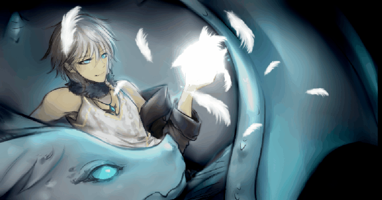
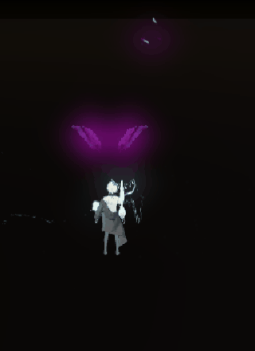
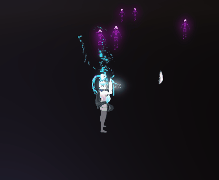
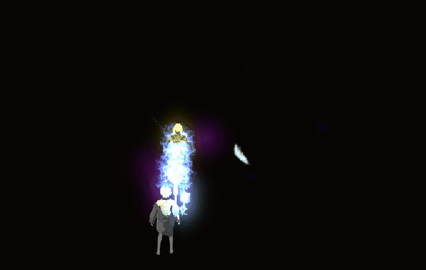
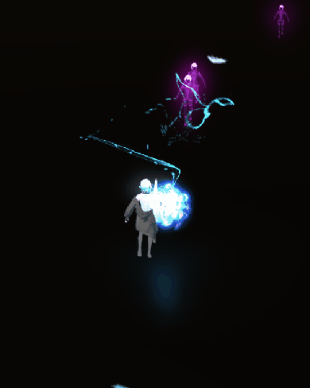
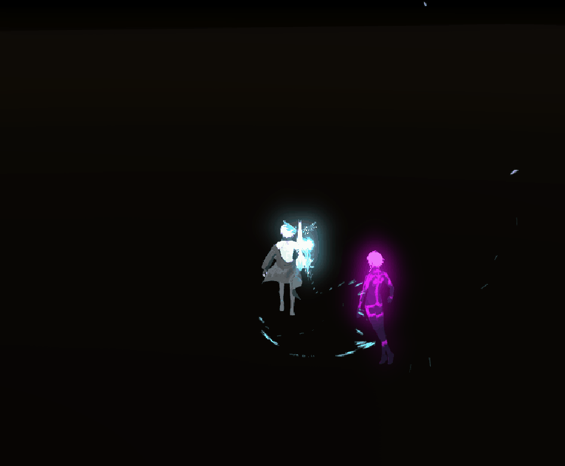

# Chronicles of Rhonea the Game
A personal project made with Unity3D  
Visual novel, 3rd-person hack-and-slash-style game.  

***Incomplete/In-Progress!***  
\
**This repository only contains some sample scripts from the full project.**
- assets are not included
- some scripts are not included  

### Updated 05-07-2019 v0.91 Game-only demo
- updated game-only demo's start screen art

- added ranged enemy

## The current build is v0.91   
Game-only demo [here](https://drive.google.com/open?id=1JPWmxVyJGuWGdwMgWp4Vrh7i3Emxoiqo)  
Dialogue + game demo (Scene 0) [here](https://drive.google.com/open?id=132XmOa2-Et1H5dhK19P1-VTv4pi3dTra)  

## Screenshots

3-stage arrow attack - 3rd shot does more damage  

Zephir's fire attack - mana dependent (mana bar not shown)   

Orb attack - animated mesh with collider  

Circle spell (and player taking damage) - temporarily stuns mobs  

Blink movement skill - blinks in direction of movement input, terrain sensitive    

Dialogue - click to advance, click again to display all text; 3D sprites have separate animations and expressions  

Camera Raycasting - corrects for (layer-specified) objects that appear between the camera and player  

## Features (of game-only demo)
- saves high score
- 4 attack types: Zephir's fire, arrow attack, orb attack, circle spell, + a blink skill
- camera follows mouse and zooms in/out with mouse wheel scroll
- player movement is relative to camera
- player faces center of the screen when turning left/right for ease of aiming, but blinks in the direction of movement input

### Known Issues/To-Do's
- emoji glow in built version is obnoxiously opaque
- player has strange invulnerability frames when taking continuous damage from many mobs
- composing background music, will add in the future
- wing mobs appear to take damage from circle spell when outside of its range
- up-left and up-right face direction is unintuitive; need to correct to face the opposite way (inwards)
